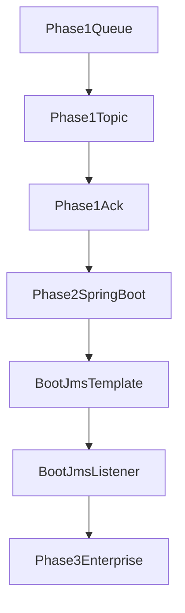

# ActiveMQ Demo 学习项目

这是一个面向 Java 学习者的 ActiveMQ Demo 项目，目标是通过“先原生 JMS，再 Spring Boot JMS”的路线，逐步理解消息中间件的核心概念、编程模型和工程实践。

当前项目已经整理为多模块结构：
- `phase1-jms`：原生 JMS 学习模块
- `phase2-springboot`：Spring Boot JMS 学习模块

---

## 1. 学习目标

通过本项目，你将掌握：

- MQ 的核心价值：异步、解耦、削峰
- ActiveMQ 中的核心角色：Broker、Queue、Topic、Producer、Consumer
- JMS 基础对象：`ConnectionFactory`、`Connection`、`Session`、`Message`
- 消息确认机制：`AUTO_ACKNOWLEDGE`、`CLIENT_ACKNOWLEDGE`
- Queue 与 Topic 的语义差异
- Spring Boot 中 `JmsTemplate` 和 `@JmsListener` 的使用方式

---

## 2. 当前项目结构

```text
activeMQDemo
├─ pom.xml
├─ README.md
├─ docs
│  ├─ DLQ.md
│  ├─ message-replay.md
│  ├─ mysql-audit-consistency.md
│  ├─ multi-environment.md
│  └─ PROGRESS.md
├─ phase1-jms
│  ├─ pom.xml
│  └─ src
│     ├─ main
│     │  ├─ java
│     │  │  ├─ queue
│     │  │  │  ├─ QueueProducer.java
│     │  │  │  ├─ QueueConsumer.java
│     │  │  │  ├─ QueueConsumerAutoAck.java
│     │  │  │  ├─ QueueConsumerClientAck.java
│     │  │  │  └─ QueueProducerAckDemo.java
│     │  │  └─ topic
│     │  │     ├─ TopicPublisher.java
│     │  │     ├─ TopicSubscriberA.java
│     │  │     └─ TopicSubscriberB.java
│     │  └─ resources
│     └─ test
└─ phase2-springboot
   ├─ pom.xml
   └─ src
      ├─ main
      │  ├─ java
      │  └─ resources
      └─ test
```

说明：
- 根目录 `pom.xml` 是父工程，用于统一管理多模块。
- `phase1-jms` 已有可运行示例。
- `phase2-springboot` 为 Spring Boot + JMS + Redis 幂等 + MySQL 审计的完整示例；进阶步骤见 `docs/`。

---

## 3. 环境要求

- JDK 21
- Maven 3.9+
- ActiveMQ Classic 6.2.4

推荐使用 Docker 启动 ActiveMQ：

```bash
docker run -d --name activemq ^
  -p 61616:61616 -p 8161:8161 ^
  rmohr/activemq
```

常用地址：
- Broker：`tcp://localhost:61616`
- 管理控制台：`http://localhost:8161`
- 常见默认账号密码：`admin/admin`

---

## 4. 学习路线图



---

## 5. Phase 1：原生 JMS

`phase1-jms` 模块用于学习 JMS 底层 API，重点在于理解消息模型本身，而不是框架封装。

### 5.1 任务 A：Queue 点对点模型

目标：
- 实现一个生产者、一个消费者
- 验证 Queue 中一条消息通常只由一个消费者处理

已完成内容：
- `QueueProducer`：向 `demo.queue` 发送 10 条文本消息
- `QueueConsumer`：从 `demo.queue` 接收并打印消息
- 已验证 Broker 控制台中的消息堆积与清空过程

关键结论：
- Queue 适合订单、支付、任务分发这类“一个任务只执行一次”的场景
- Queue 强调竞争消费和可靠处理

思考题参考答案：
- Queue 采用竞争消费模型，同一条消息通常只被一个消费者处理。
- 异步发送可以降低主链路压力，实现削峰填谷。
- 增加消费者实例可以提升吞吐量，适合后台任务分发。

建议继续思考：
- 为什么“消息持久化”不等于“业务绝不丢失”？
- 当消息堆积时，优先扩消费者还是优化业务处理逻辑？

### 5.2 任务 B：Topic 发布订阅模型

目标：
- 实现一个发布者、两个订阅者
- 验证同一消息会被多个订阅者分别接收

已完成内容：
- `TopicPublisher`：向 `demo.topic` 发布消息
- `TopicSubscriberA` / `TopicSubscriberB`：接收同一 Topic 消息
- 已验证双订阅者控制台都能收到广播消息

关键结论：
- Topic 适合通知广播、事件传播、事件总线
- Topic 强调“同一事件被多个下游同时感知”

思考题参考答案：
- Topic 采用发布订阅模型，一条消息可被多个订阅者分别接收。
- 发布者与订阅者解耦，新增订阅者通常不需要修改发布者代码。
- 一个业务事件可驱动多个下游系统，如通知、积分、报表。

建议继续思考：
- 为什么订阅者启动晚了可能收不到历史消息？
- 如果既想广播，又想某处理只执行一次，该如何组合 Queue 和 Topic？

### 5.3 任务 C：消息确认与异常实验

目标：
- 理解 `AUTO_ACKNOWLEDGE` 与 `CLIENT_ACKNOWLEDGE`
- 观察异常时未确认消息的行为

已完成内容：
- `QueueConsumerAutoAck`：自动确认消费者
- `QueueConsumerClientAck`：手动确认消费者
- `QueueProducerAckDemo`：向 `demo.queue.ack` 发送 `OK-*` 与 `FAIL_ME` 测试消息
- 已完成异常实验：命中 `FAIL_ME` 后抛出异常，Broker 中出现滞留消息

实验现象总结：
- `AUTO_ACKNOWLEDGE`：使用简单，但业务几乎无法精细控制确认时机
- `CLIENT_ACKNOWLEDGE`：适合“处理成功再确认”的可靠消费模式
- 当异常路径未执行 `acknowledge()` 时，消息会保留在 Broker，后续可能重新投递

思考题参考答案：
- 生产环境需要幂等，是因为 MQ 常见语义是“至少一次”，重复消费并不罕见。
- 如果业务本身非幂等，重复消费可能带来重复扣费、重复下单等副作用。

建议继续思考：
- 为什么要在日志中记录 `messageId` 或业务主键？
- 如何区分是 Broker 重投还是业务层重复提交？

---

## 6. Phase 1 当前进度

- [x] Queue 生产者与消费者
- [x] Topic 发布者与双订阅者
- [x] `AUTO_ACKNOWLEDGE` 实验
- [x] `CLIENT_ACKNOWLEDGE` 实验
- [x] 异常不确认导致消息滞留实验

Phase 1 已完成基础学习闭环，可以作为后续 Spring Boot 封装学习的对照组。

---

## 7. Phase 2：Spring Boot JMS

`phase2-springboot` 模块用于学习框架化写法，让你在已经理解 JMS 原理的基础上，掌握企业项目里更常见的开发方式。

### 计划内容

1. 创建 Spring Boot 启动类
2. 配置 `application.yml`
3. 使用 `JmsTemplate` 发送消息
4. 使用 `@JmsListener` 接收消息
5. 完成本地运行与验证

### 当前状态

- [x] 已建立模块骨架
- [x] 已完成 Phase 2 多模块 `pom` 配置并通过 `compile`
- [x] 已创建 Spring Boot 启动类
- [x] 已创建 `application.yml`
- [x] 已实现 `JmsTemplate` 发送服务
- [x] 已实现 `@JmsListener` 消费
- [x] 已移除启动时自动发送，改为 REST 接口触发
- [x] 已完成本地运行验证，消息发送与消费正常

### 当前实现说明

- 启动类：`com.example.Application`
- 发送服务：`com.example.services.MessageProducerService`
- 消费监听：`com.example.components.MessageConsumerListener`
- 队列配置：`demo.queue.boot`

当前 Phase 2 已具备最小可运行闭环：
- Spring Boot 应用启动
- `MessageController` 通过 HTTP 触发发送（需请求头 `X-Idempotency-Key`）
- `JmsTemplate` 发送消息到队列
- `@JmsListener` 自动消费并打印日志

### Phase 2 当前结论

- 你已经完成了从“原生 JMS”到“Spring Boot JMS”的第一轮过渡。
- 与 Phase 1 相比，Spring Boot 明显减少了连接创建、会话管理、消费者注册等样板代码。
- 通过 `application.yml` + `JmsTemplate` + `@JmsListener`，已经建立了一个更贴近企业开发的最小消息应用。
- 当前实现适合继续扩展为控制器触发发送、多环境配置、异常处理、重试与幂等方案。

---

## 8. Phase 3：企业级演进与持久化幂等

目标：在已跑通 JMS 与 Spring Boot 的基础上，补齐企业项目常见的“可交付能力”：HTTP 触发、校验、失败可观测、幂等与死信治理。

### 8.1 持久化幂等：Redis 与 MySQL 方案对比

| 维度 | Redis 幂等 | MySQL 幂等表 |
|------|------------|--------------|
| 典型实现 | `SET key NX EX ttl`，仅首次写入成功 | 唯一索引插入 `idempotency_key`，冲突即重复 |
| 性能与并发 | 高，适合高 QPS 挡重复 | 取决于库与索引，通常低于 Redis |
| 运维与容量 | 需关注内存、TTL、键规模 | 需归档、清理、表增长 |
| 审计与对账 | 弱（除非额外落库或持久化日志） | 强，可存状态、时间、业务快照 |
| 与事务一致性 | 非强事务存储；与本地事务联动需额外设计 | 与业务库同事务更容易（仍要注意“发消息”与“写库”一致性） |
| 适用场景 | 接口幂等、防重复提交、高并发去重 | 支付/订单级强审计、补偿、合规留痕 |

**结论（教学与企业常见路径）**

- **优先 Redis**：实现快、与接口幂等场景高度匹配，适合本 Demo 先做出“可感知的企业级效果”。
- **再补 MySQL**：作为进阶章节，演示强审计、状态机与补偿流程。
- **组合策略**：不少线上系统采用 **Redis 前置快速去重 + DB 关键链路留痕**，二者并不互斥。

### 8.2 建议实施路线（本项目采用）

1. **Redis 幂等（当前路线）**：依赖与连接配置 → `SET NX` 封装 → 替换内存版 `IdempotencyService` → 验证同 key 不重复入队。
2. **MySQL 幂等表（进阶）**：建表与唯一约束 → 插入抢占 → 与业务状态联动（可选）。
3. **DLQ 与重试治理（并行深化）**：参数化重试、死信检索与人工补偿（与幂等互补）。

### 8.3 Phase 3 进度（Redis 幂等）

| 子步骤 | 内容 | 状态 |
|--------|------|------|
| R1 | `phase2-springboot` 引入 `spring-boot-starter-data-redis` | [x] 已完成 |
| R2 | `application.yml` 配置 Redis 连接 | [x] 已完成 |
| R3 | 使用 `StringRedisTemplate` 实现 `SET key NX EX` 封装 | [x] 已完成 |
| R4 | 移除内存幂等，仅保留 Redis；去掉 `RedisAutoConfiguration` 的 exclude（若曾添加） | [x] 已完成 |
| R5 | 本地验证：同 `X-Idempotency-Key` 仅首次入队 | [x] 已完成 |

说明：`IdempotencyService` 已采用 **Redis `setIfAbsent`（等价 SET NX）+ TTL**；`MessageController` 仍只依赖该服务，无需为 Redis 单独改接口签名。

**Redis 幂等键形态（验收参考）**

- Key：`{demo.idempotency.redis-key-prefix}{X-Idempotency-Key}`，例如前缀为 `idem:` 时，请求头 `X-Idempotency-Key: KEY-1` 对应 Redis 键 `idem:KEY-1`。
- Value：固定占位字符串 `"1"`。
- 过期：`TTL "idem:KEY-1"` 返回正整数表示剩余秒数；`-1` 表示未设置过期（需检查代码是否传入 `Duration`）；`-2` 表示键已不存在。

**环境提示**

- 使用官方 `redis` 镜像且未配置 `--requirepass` 时，**默认无密码**，`application.yml` 中不必配置 `spring.data.redis.password`。
- 在 **PowerShell** 下对含 `:` 的 key 执行 `redis-cli` 时，建议对 key **加双引号**，例如：`TTL "idem:KEY-1"`。

### 8.4 Phase 4：数据库幂等审计（MySQL + MyBatis-Flex，进行中）

在 **Redis 快速挡重复** 的基础上，用 **MySQL 唯一约束** 做可审计、可对账的留痕（企业常见组合：**Redis + DB**）。

| 步骤 | 内容 | 状态 |
|------|------|------|
| M1 | `phase2-springboot` 引入 `mybatis-flex-spring-boot3-starter` 与 `mysql-connector-j` | [x] 已完成 |
| M2 | `application.yml` 配置 MySQL 数据源（用于 MyBatis-Flex） | [x] 已完成 |
| M3 | 实体 `IdempotencyRecord`，列 `idempotency_key` 唯一约束 | [x] 已完成 |
| M4 | `Mapper` + 在首次成功发消息后写入审计行（与 Redis 幂等键一致） | [x] 已完成 |
| M5 | 验证：同 key 不重复插行；用客户端执行 `SELECT` 可查 | [x] 已完成 |

说明：本地可用 **Docker MySQL**；库名、账号密码与 `application.yml` 保持一致，并先 **手动建库**（如 `CREATE DATABASE activemq_demo`）。

**M5 验收结论**

- 同一 `X-Idempotency-Key` 连续请求两次：第一次走 Redis `SET NX` 成功并发送消息、写入 `idempotency_record`；第二次 Redis 判重失败，接口返回「重复请求，已忽略」，**不再发送、不再插库**。
- 数据库中同一幂等键仅 **一行** 审计记录，符合预期。

### 8.5 Phase 5：DLQ / 死信（进行中）

在 **消费失败可重投** 的基础上，理解 **超过重试上限后进入死信队列**，并与控制台运维结合。

| 步骤 | 内容 | 状态 |
|------|------|------|
| D1 | 发送 `FAIL_ME`，日志中确认重投与 `JMSXDeliveryCount` | [ ] 待完成 |
| D2 | 配置 `RedeliveryPolicy`（如 `ActiveMQConnectionFactoryCustomizer`），缩短进入 DLQ 的路径 | [ ] 待完成 |
| D3 | Web 控制台查看 **`ActiveMQ.DLQ`**（或 Broker 配置的 `DLQ.*`） | [ ] 待完成 |
| D4（可选） | 浏览或只读监听 DLQ，说明人工/补偿流程 | [ ] 待完成 |

**文档**：分步说明、概念与验收见 [docs/DLQ.md](docs/DLQ.md)；断点续学见 [docs/PROGRESS.md](docs/PROGRESS.md)。

### 8.6 Phase 6：企业级补充（进行中）

**6-1 多环境配置（已落地）**

`phase2-springboot` 已拆分为：

- `application.yml`：应用名、默认 profile `dev`、共用的 `demo.idempotency`
- `application-dev.yml`：本地 Docker（与原单机配置等价）
- `application-prod.yml`：环境变量占位示例（`ACTIVEMQ_BROKER_URL`、`MYSQL_URL`、`REDIS_HOST` 等）
- `application-local.yml.example`：复制为 `application-local.yml` 可做个人覆盖（该文件已加入 `.gitignore`）

说明见 [docs/multi-environment.md](docs/multi-environment.md)。

**6-2 与 MySQL 审计的一致性说明（已落地）**  

- 文档见 [docs/mysql-audit-consistency.md](docs/mysql-audit-consistency.md)。
- 结论：当前链路（Redis 抢占 → 发 MQ → 写审计）是 **最终一致 + 可补偿**，不是单事务强一致。

**6-3 消息回放（已落地）**

- 文档见 [docs/message-replay.md](docs/message-replay.md)。
- 覆盖回放三道闸门（修根因、幂等键策略、环境确认）与最小验收命令。

---

## 9. 如何运行

### 9.1 构建整个项目

在根目录执行：

```bash
mvn clean package -DskipTests
```

### 9.2 运行 Phase 1 示例

在 IDEA 中直接运行对应 `main` 方法即可：

- Queue：
  - `queue.QueueProducer`
  - `queue.QueueConsumer`
- Topic：
  - `topic.TopicPublisher`
  - `topic.TopicSubscriberA`
  - `topic.TopicSubscriberB`
- Ack：
  - `queue.QueueProducerAckDemo`
  - `queue.QueueConsumerAutoAck`
  - `queue.QueueConsumerClientAck`

建议顺序：
- Queue：先消费者，再生产者
- Topic：先两个订阅者，再发布者
- Ack：先发送，再根据实验目标启动不同消费者

### 9.3 运行 Phase 2 示例

在 IDEA 中运行：

- `com.example.Application`

当前推荐的运行方式：
- 启动 `com.example.Application` 与 ActiveMQ
- 调用 `POST /api/message`，请求头携带 `X-Idempotency-Key`，Body 为 `{"text":"..."}`
- `MessageConsumerListener` 监听 `demo.queue.boot` 并输出消费日志

预期现象：
- 首次某幂等键：消息入队并被消费；重复同键：接口返回「重复请求，已忽略」，不再重复入队（当前为 **Redis 幂等**）。

Profile：默认 **`dev`**（见 `application.yml`）。连接生产式 Broker 时请显式 **`--spring.profiles.active=prod`** 并配置环境变量，详见 [docs/multi-environment.md](docs/multi-environment.md)。

---

## 10. 常见问题

### 10.1 无法连接 ActiveMQ

检查：
- `61616` 端口是否已开放
- Broker 是否已启动
- 用户名密码是否正确

### 10.2 消费者收不到消息

检查：
- Queue/Topic 名称是否完全一致
- Topic 是否先启动订阅者再启动发布者
- 是否被其他消费者先消费掉

### 10.3 消息重复或滞留

检查：
- 是否使用了 `CLIENT_ACKNOWLEDGE`
- 是否在异常路径遗漏 `acknowledge()`
- 是否因为业务异常导致进程提前退出

---

## 11. 下一步建议

1. 阅读并执行 [docs/message-replay.md](docs/message-replay.md) 的最小验收，完成一次受控回放演练。
2. 回放前先阅读 [docs/mysql-audit-consistency.md](docs/mysql-audit-consistency.md)，统一一致性语义（最终一致 + 补偿）。
3. 下一轮可选：回放专用接口、审计状态机、回放审批与限流。

---

## 12. 当前说明

这份 README 依据当前工程真实状态重新生成。  
如果后续你继续完成 Phase 2，建议再同步更新本文件中的：
- 模块结构
- 已完成进度
- 运行步骤
- 学习总结
